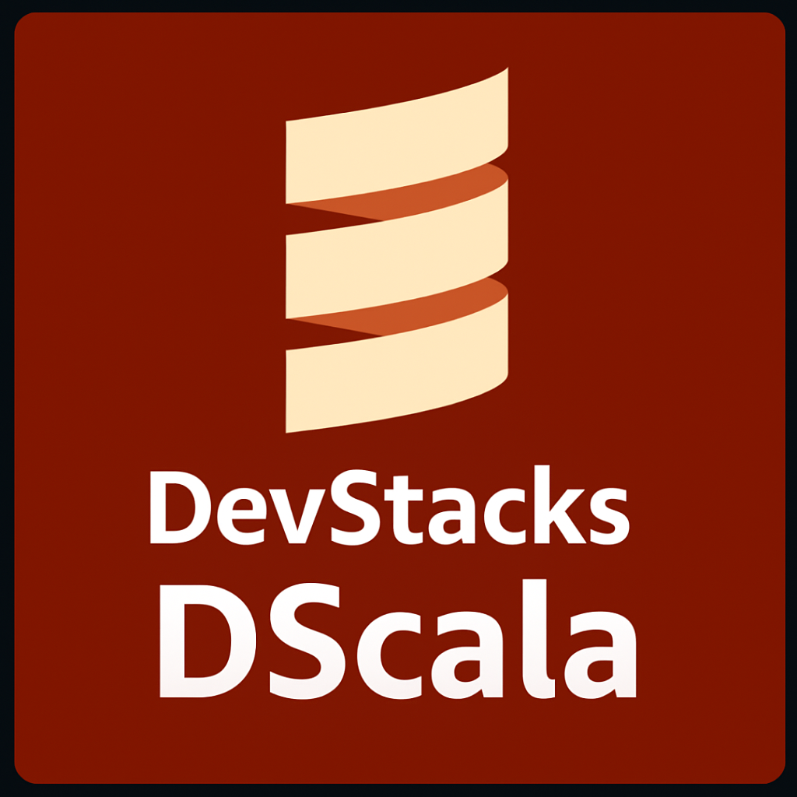

  

<h1 align="center">DevStacks DPhx</h1>

# DScala 🧪

**DScala** is a rebranded and customized fork of the [Scala](https://github.com/scala/scala) programming language, maintained by DevStacks as part of the DLangSDK compiler suite.

---

## 🌀 What is DScala?

DScala combines functional and object-oriented programming on the JVM. This fork integrates with DevStacks’ DLangSDK to allow streamlined cross-language development and better interoperability across your codebases.

---

## 🔧 Features (inherited from Scala)

- Runs on the JVM
- Functional + object-oriented hybrid
- Type inference and pattern matching
- Great for backend systems and data science workflows

---

## 🧱 Integration

Run `dscala` using [DLangSDK](https://github.com/DevStacks-io/DLangSDK), your one-click universal compiler CLI.

DScala is part of the [HobbyStack](https://github.com/DevStacks-io/HobbyStack), a stack dedicated to expressive, experimental, and hybrid languages.

---

## 📜 License & Attribution

This project is licensed under the **Apache 2.0 License** (original license from Scala).

> Originally forked from: [https://github.com/scala/scala](https://github.com/scala/scala)  
> Created and maintained by the Scala community.  
> This version is maintained under the DevStacks ecosystem.
